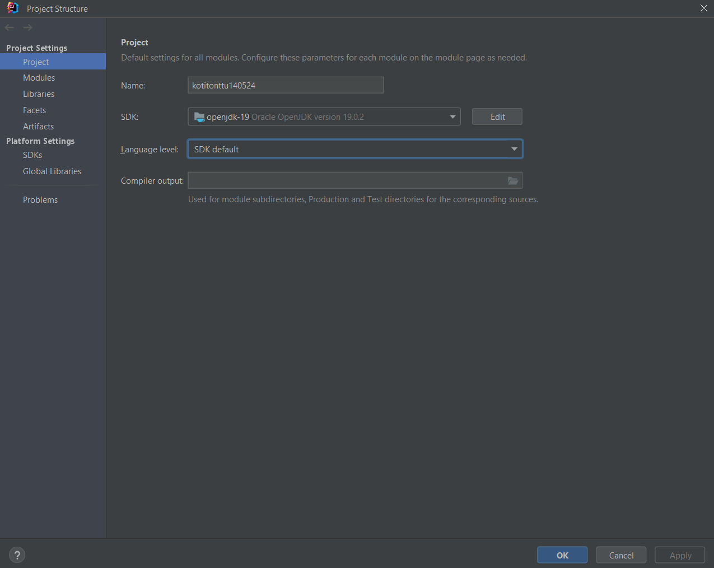
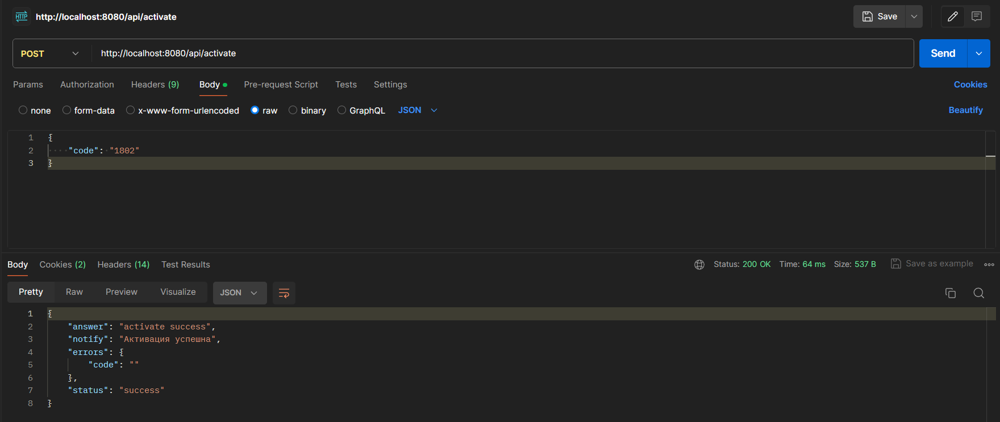
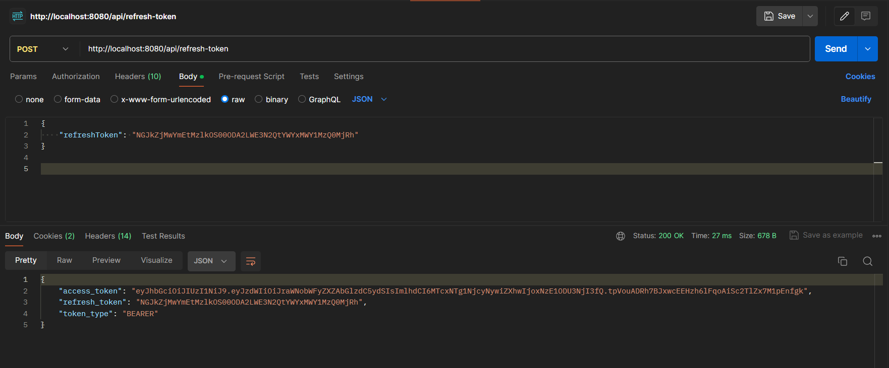
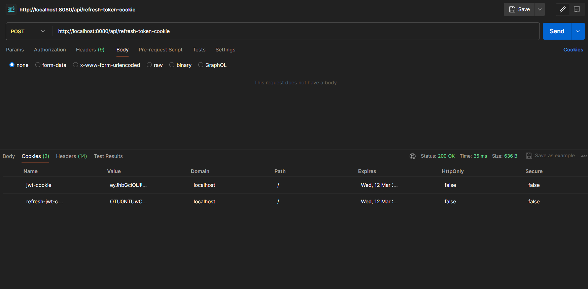
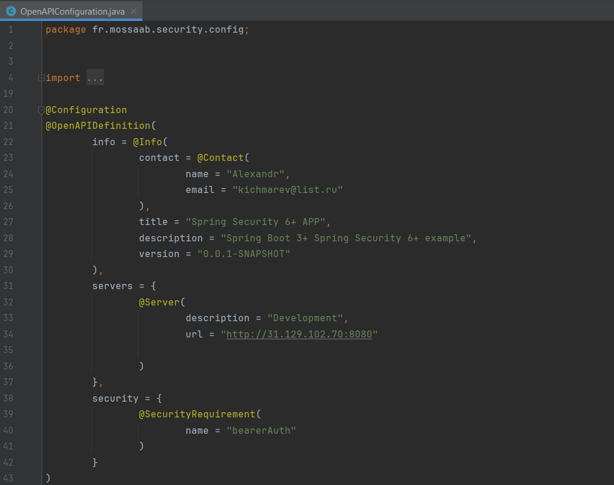

# Kotitonttu: серверная часть приложения для отопительных систем

## Реализация JWT с Spring Boot 3 и Spring Security 6

Этот репозиторий демонстрирует проект, который демонстрирует реализацию 
JSON Web Tokens (JWT) с Spring Boot 3 и Spring Security 6. 
## Функциональность проекта

  - Регистрация пользователя и вход в систему с аутентификацией по JWT
  - Токен обновления хранится в базе данных
  - Авторизация на основе ролей с разрешениями
  - Настроенная обработка отказа в доступе
  - Интеграция документации OpenAPI (Swagger)
    
## Стек технологий

  -  Spring Boot 3
  -  Spring Security
  -  Spring Data JPA
  -  Пользовательская валидация Spring Boot
  -  JSON Web Tokens (JWT)
  -  BCrypt
  -  Maven
  -  OpenAPI (SpringDoc Impl)
  -  Lombok

## Локальное начало работы

  1) Чтобы начать работу с этим проектом, вам нужно будет установить следующее на своем локальном компьютере:
     - JDK 17+ (указано в файле pom.xml)
     - IDE (желательно IntelliJ IDEA)
     - SDK, которую я использую:
       
  
  2) В файле application.properties поменять username и password MySQL c глобального на свой локальный:
     ```properties
     #Это:
     spring.datasource.username=kotitonttu
     spring.datasource.password=Eq13034513!
     ```
     ```properties
     #Заменить например на это:
     spring.datasource.username=root
     spring.datasource.password=sasha
     ```
  3) Создать в консоли или через графический интерфейс посредством приложения "MySQL Workbench" новую пустую схему с названием "vuary" согласно настройке:
     ```properties
     spring.datasource.url=jdbc:mysql://127.0.0.1:3306/vuary?serverTimezone=Europe/Moscow
     ```
     
  
  4) Запустить сервер через уже настроенную конфигурацию "SecurityApplication"

 ## Перезапуск удаленного сервера

  1. Открыть окошко с командой одновременно нажмите клавишу Windows и кнопку R
  2. Наберите в строке cmd, а затем зажмите комбинацию Ctrl+Shift+Enter
  3. Входим на сервер через команду:
     ```bash
     ssh root@31.129.102.70
     ```
  4. Потом попросит пароль, вводим:
     ```bash
     Qq13037613!
     ```
  5. Перезапускаем сервер:
     ```bash
     cd kotitonttu
     sh shutdown.sh
     tail -f log.txt
     ctrl + c
     cd ~
     rm -r kotitonttu
     git clone https://github.com/Kichmarevitmo/kotitonttu.git
     cd kotitonttu
     mvn wrapper:wrapper
     ./mvnw spring-boot:run
     ctrl + c
     sh startup.sh
     tail -f log.txt
     ctrl + c
     exit
     ```

# Локальное тестирование посредством Postman 
## Этот endpoint позволяет пользователю зарегистрироваться (не забыть почистить cookies) и изменить путь сохранения с глобального на локальный в классе StorageService.


`POST http://localhost:8080/api/register`
## Фрагмент класса:

## Пример тестирования:

```json
{
"firstname": "Sasha",
"lastname": "Kichmarev",
"email": "kichmarev@list.ru",
"password": "Sasha123!",
"phoneNumber":"+78005553555",
"dateOfBirth" : "2000-01-01",
"workerRole" : "SELLER"
}
```
## Этот endpoint позволяет активировать пользователя для того, чтобы можно было потом войти в систему.
`POST http://localhost:8080/api/activate`
## Пример тестирования:

```json
{
    "code": "1802"
}
```
## Этот endpoint позволяет пользователю войти в систему.
`POST http://localhost:8080/api/login`
## Пример тестирования:

```json
{
    "email": "kichmarev@list.ru",
    "password": "Sasha123!"
}
```

## Этот эндпоинт позволяет обновить токен через json запрос.
`POST http://localhost:8080/api/refresh-token`
## Пример тестирования:

```json
{
    "refreshToken": "NGJkZjMwYmEtMzlkOS00ODA2LWE3N2QtYWYxMWY1MzQ0MjRh"
}
```

## Этот endpoint позволяет обновить токен с использованием куки.
`POST http://localhost:8080/api/refresh-token-cookie`
## Пример тестирования:


## Этот эндпоинт позволяет пользователю выйти из системы.
`POST http://localhost:8080/api/logout`
## Пример тестирования:


Для получения подробной документации локально и тестирования API перейдите в Swagger UI, пройдя по ссылке, предварительно изменив ip адресс удаленного сервера на localhost в классе OpenAPIConfiguration:
```
http://localhost:8080/swagger-ui.html
```

